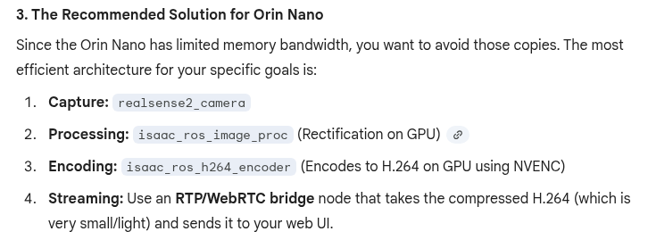

# RC car autonomous control

1. Pre-Docker
sudo sh -c 'echo -1 > /sys/module/usbcore/parameters/autosuspend'
# Force Max Performance
sudo nvpmodel -m 2
sudo jetson_clocks

2. Launch Docker - then 2 more after first is loaded
cd ${ISAAC_ROS_WS}/src/isaac_ros_common/scripts
./run_dev.sh -d ${ISAAC_ROS_WS}

3. Inside Docker
source /opt/ros/humble/setup.bash
source install/setup.bash
# needed!! 
export LD_LIBRARY_PATH=$LD_LIBRARY_PATH:/opt/ros/humble/share/isaac_ros_gxf/gxf/lib/serialization
sudo chmod 666 /dev/bus/usb/002/003
sudo chgrp plugdev /dev/bus/usb/002/003
sudo cp 99-realsense-libusb.rules /etc/udev/rules.d/
sudo rm /etc/udev/rules.d/99-realsense-libusb-custom.rules

4. Launch
ros2 launch isaac_ros_realsense_control realsense_visual_slam.launch.py  run_foxglove:=True

5. Test
ros2 topic echo (camera/vslam/nvblox...)
ros2 topic topic echo /visual_slam/status --once
/nvblox_node/mesh  -- camera needs to move

foxglove - 3D nvblox_node/mesh, image - camera/infra1/rect_raw_whatever

6. rebuild as needed
colcon build --packages-select isaac_ros_realsense_control  --symlink-install
source install/setup.bash


# Verify the HID modules are loaded
sudo modprobe hid-sensor-hub hid-sensor-accel-3d hid-sensor-gyro-3d

# Quick check that the camera sees the Motion Module
rs-enumerate-devices -v


# F1 - Remote-ssh: Open configuration
# wired - 192.168.86.42
# wifi - 192.168.86.245

# wifi off
sudo nmcli radio wifi off
# wifi on
sudo nmcli radio wifi on
# Check Wi-Fi status (look for "enabled" or "disabled")
nmcli radio wifi

# kill dead usb ownership?
pkill -f "ros2 launch" 2>/dev/null; pkill -f realsense 2>/dev/null; pkill -f visual_slam 2>/dev/null; sleep 2; echo "Killed all"

# kill dead/restart realsense from host
-- unplug D435i
sudo udevadm control --reload-rules && sudo udevadm trigger
-- plug back in, check date
sudo usbreset 8086:0b3a

# test w/ lsusb

### first time only - top level
# Disable USB power saving
sudo sh -c 'echo -1 > /sys/module/usbcore/parameters/autosuspend'
# Force Max Performance
sudo nvpmodel -m 2
sudo jetson_clocks


## Don't do the following with realsense container - at least see if we work without
sudo chmod -R 666 /dev/bus/usb
sudo cp 99-realsense-libusb.rules /etc/udev/rules.d/
sudo udevadm control --reload-rules && sudo udevadm trigger
# this was no power saving - hopefully not needed w/ container
sudo bash -c 'echo -1 > /sys/module/usbcore/parameters/autosuspend'


##### docker starting commands
cd ${ISAAC_ROS_WS}/src/isaac_ros_common/scripts
./run_dev.sh -d ${ISAAC_ROS_WS}

#####  
#after docker launch
#####
source /opt/ros/humble/setup.bash
source install/setup.bash
# needed!! 
export LD_LIBRARY_PATH=$LD_LIBRARY_PATH:/opt/ros/humble/share/isaac_ros_gxf/gxf/lib/serialization
sudo chmod 666 /dev/bus/usb/002/003
sudo chgrp plugdev /dev/bus/usb/002/003
sudo cp 99-realsense-libusb.rules /etc/udev/rules.d/
sudo rm /etc/udev/rules.d/99-realsense-libusb-custom.rules

# nope, not in docker
sudo udevadm control --reload-rules
sudo udevadm trigger

usbreset
# Build Visual SLAM package 
colcon build --packages-select isaac_ros_realsense_control  --symlink-install
source install/setup.bash

ros2 launch isaac_ros_realsense_control realsense_visual_slam.launch.py  run_foxglove:=True

ros2 launch isaac_ros_realsense_control realsense_d435i.launch


ros2 launch isaac_ros_realsense_control realsense_basic.launch.py 
## time sync check
ros2 run tf2_ros tf2_monitor base_link camera_infra1_optical_frame


##########

ros2 launch foxglove_bridge foxglove_bridge_launch.xml

To see your 3D data, configure your 3D Panel as follows:

Coordinate Frame: Set your "Global Frame" to map.

Transforms: Ensure /tf is active. You should see a tree connecting map -> odom -> base_link -> camera_link.

Visual SLAM Topics:

/visual_slam/tracking/odometry (Odometry type)

/visual_slam/vis/landmarks_cloud (PointCloud2)

nvblox Mesh:

/nvblox_node/mesh — Important: You must install the nvblox Foxglove extension from the Foxglove Extension Marketplace to see the textured mesh properly.

Pro-Tips for your Setup:
The Mesh: If the nvblox mesh doesn't appear, ensure you have the nvblox extension enabled in Foxglove (Settings > Extensions).

The Grid: I have set the global frame to map. If the grid looks like it's drifting, it means Visual SLAM has lost its "Loop Closure" or is re-initializing.

Performance: If the 3D view is laggy, go to the 3D panel settings and toggle "Decay Time" for the /visual_slam/vis/landmarks_cloud to a lower value (e.g., 5 seconds).

##########
# optimized, less laggy
ros2 run foxglove_bridge foxglove_bridge --ros-args \
  -p send_buffer_limit:=100000000 \
  -p num_threads:=2
#########################


##### continue w/ documenation
Features:
- ROS2 true, as much as possible.   Note this is using Humble.   While the most recent update from nVidia is moving to Jazzy.    This change alone will break things.
- leverage nVidia stack as much as possible (via the NVidia docker setup for Jetson (Orin) Nano/x86)
- WebRTC




[isaac ROS base page](https://nvidia-isaac-ros.github.io/v/release-3.2/index.html)


Summary Table: Component MappingGoalIsaac ROS PackageHardware Resource UsedVIO / Odometryisaac_ros_visual_slamGPU & IMUStereo Depthisaac_ros_ess (Optional)DLA / GPUMappingisaac_ros_nvbloxGPU (CUDA)PlanningNav2 (Integrated)CPU / GPUWebRTC Videoisaac_ros_h264_encoderNVENC (Video Encoder)Remote Control10isaac_ros_mission_client11CPU12

Commands of high interest:

```
docker
docker images
docker rm <number>


Launch - note the-d flag

-p 8765:8765
--shm-size=2g


## NO, we're back to using the realsense docker container - so no need for custom librealsense2


Best practice: Build librealsense2 separately with its special arguments, then build the rest of your workspace normally.


# for a colcon build - do librealsense special... 
# colcon build --packages-ignore librealsense2 --symlink-install --parallel-workers 4
colcon build --packages-ignore librealsense2 --parallel-workers 4

# per Gemini - (RSUSB/Source method is the community-standard fix for Isaac ROS users.)
# Clean and rebuild librealsense2 with correct version (2.55.1) and tools enabled
# Note: Isaac ROS requires 2.55.1. Do not use 2.57.x as it causes USB disconnects.
git fetch --all
git checkout v2.55.1

#  --parallel-workers 4
# don't need graphical examples anymore, probably
rm -rf build/librealsense2 install/librealsense2
colcon build --packages-select librealsense2 \
  --cmake-args \
    -DFORCE_RSUSB_BACKEND=ON \
    -DBUILD_WITH_CUDA=ON \
    -DCMAKE_BUILD_TYPE=release \
    -DBUILD_EXAMPLES=true \
    -DBUILD_GRAPHICAL_EXAMPLES=true
source install/setup.bash


#########################
# Testing - basic realsense
colcon build --packages-select isaac_ros_realsense_control
source install/setup.bash
ros2 launch isaac_ros_realsense_control realsense_basic.launch.py

ros2 launch foxglove_bridge foxglove_bridge_launch.xml

##########
# optimized, less laggy
ros2 run foxglove_bridge foxglove_bridge --ros-args \
  -p send_buffer_limit:=100000000 \
  -p num_threads:=2
#########################


# WORKS - I think - ros2 launch isaac_ros_visual_slam isaac_ros_visual_slam_realsense.launch.py
ros2 launch isaac_ros_realsense_control realsense_basic.launch.py

# working on...
ros2 launch isaac_ros_realsense_control realsense_visual_slam.launch.py run_foxglove:=True


## ????
sudo ufw allow 8765/tcp
sudo ufw enable
run sudo ufw allow ssh


# only needed once
sudo rm /etc/udev/rules.d/99-realsense-libusb-custom.rules
#####


Testing the hardware control
colcon build --packages-select rc_hardware_control 
colcon build --parallel-workers 4 

ros2 launch rc_hardware_control steering_tracking_example.launch.py

test - suggested max, conservative values to start with - twist isn't right message, probably 
ros2 topic pub /bicycle_steering_controller/reference_unstamped geometry_msgs/msg/Twist "{linear: {x: 0.04}, angular: {z: 0.02}}" 

and third window
ros2 topic echo /joint_states
ros2 topic echo /joint_states --field velocity


-or- only for joint, steer, traction
ros2 launch rc_hardware_control basic_steering_traction.launch.py


Start with everything stopped/centered
ros2 topic pub /steering_controller/commands std_msgs/msg/Float64MultiArray "data: [0.0]" --once
ros2 topic pub /traction_controller/commands std_msgs/msg/Float64MultiArray "data: [0.0]" --once

# clean up one 'error'
sudo chmod +666 /etc


# moved back to apt install - until proven otherwise...
# Clean and rebuild librealsense2 with correct version (2.57.5) and tools enabled
# Clean and rebuild librealsense2 with correct version (2.55.1) and tools enabled
rm -rf build/librealsense2 install/librealsense2
colcon build --packages-select librealsense2 --parallel-workers 4 \
  --cmake-args \
    -DFORCE_RSUSB_BACKEND=ON \
    -DBUILD_WITH_CUDA=ON \
    -DCMAKE_BUILD_TYPE=release \
    -DBUILD_EXAMPLES=true \
    -DBUILD_GRAPHICAL_EXAMPLES=true

## Downgrade realsense-ros to match librealsense 2.55.1
# The latest ROS wrapper requires librealsense 2.56+, which causes issues on Jetson.
# Ensure you are in the workspace root
cd src/realsense-ros
git checkout 4.55.1
cd ../..

## Needed - though can probably just use 
# colcon build --parallel-workers 4
colcon build --packages-select realsense2_camera --cmake-clean-cache --allow-overriding realsense2_camera --parallel-workers 4

# Build your control package
colcon build --packages-select isaac_ros_realsense_control

# Test basic camera first, then add visual SLAM later
# ros2 launch isaac_ros_realsense_control realsense_basic.launch.py
ros2 launch isaac_ros_realsense_control realsense_d435i.launch.py
# not sure this is needed
ros2 launch isaac_ros_realsense_control realsense_d435i.launch.py enable_accel:=true enable_gyro:=true unite_imu_method:=2


# ✅ WORKING: RealSense D435i successfully initializing with all sensors:
# - Device Serial: 052622070363, FW: 5.17.0.10
# - Depth/IR: 848×480@30fps, RGB: 1280×720@30fps, IMU: Accel@250fps + Gyro@200fps

## Isaac ROS Visual SLAM Setup
# ✅ WORKING: Visual SLAM with RealSense D435i is operational!

# Build Isaac ROS NITROS first (required dependency)
colcon build --packages-select isaac_ros_nitros --parallel-workers 4
source install/setup.bash

# Build Visual SLAM package 
colcon build --packages-select isaac_ros_visual_slam --parallel-workers 4
source install/setup.bash

# Launch VSLAM with RealSense D435i
ros2 launch isaac_ros_realsense_control realsense_visual_slam.launch.py run_foxglove:=True

# ✅ VERIFIED: VSLAM topics are publishing:
# /visual_slam/tracking/odometry (main output for navigation)
# /visual_slam/tracking/slam_path (trajectory)
# /visual_slam/status (system status)
# + 20 visualization topics for debugging

# Optional: Launch with RViz visualization  
ros2 launch isaac_ros_realsense_control realsense_visual_slam.launch.py enable_rviz:=true

# Test odometry output:
ros2 topic echo /visual_slam/tracking/odometry

# Move the camera around to see SLAM mapping in action
# Note: GXF scheduler warning is harmless and doesn't affect functionality

## Isaac ROS ESS (Bi3D Edge Stereo) Setup - APT Method
# Much simpler approach using pre-compiled packages

# Install ESS models via apt (in Isaac ROS container)
sudo apt-get update
sudo apt-get install -y ros-humble-isaac-ros-ess-models-install
sudo apt-get install -y ros-humble-isaac-ros-ess

# Build any missing dependencies
colcon build --packages-select isaac_ros_nitros_disparity_image_type --parallel-workers 4
source install/setup.bash

#########################
###########################
# Test ESS with RealSense D435i
ros2 launch isaac_ros_realsense_control realsense_ess.launch.py

ros2 launch foxglove_bridge foxglove_bridge_launch.xml
#########################
###########################


# Expected output topics:
# /depth_image - ESS-generated depth image
# /disparity - Raw disparity map
# /pointcloud - 3D point cloud from ESS depth

# ✅ This approach avoids TensorRT engine compilation issues
# ✅ Uses pre-built models optimized for your platform

## Fallback: Isaac ROS Stereo Depth Processing
# If ESS still has issues, use reliable stereo processing:
colcon build --packages-select isaac_ros_stereo_image_proc --parallel-workers 4
source install/setup.bash

# Optional: Launch with stereo + ESS + VSLAM together
# (Advanced: combines hardware depth, ESS depth, and VSLAM)
ros2 launch isaac_ros_realsense_control realsense_ess_vslam.launch.py

```

## Foxglove Support

To use Foxglove Studio for visualization:

```bash
# Launch Foxglove bridge
ros2 launch foxglove_bridge foxglove_bridge_launch.xml

# Or run manually
ros2 run foxglove_bridge foxglove_bridge --ros-args -p port:=8765

# Then open Foxglove Studio and connect to:
# ws://localhost:8765 (if running locally)
# ws://<robot_ip>:8765 (if running on remote robot)
```

Also
```
i2c access - fixed (using gemini AI - go there to see how)
sudo chmod 666 /dev/gpiochip0 /dev/gpiochip1 /dev/i2c-0 /dev/i2c-1 /dev/i2c-7

need video (only needed if startted without a video monitor live ???)
sudo rm /dev/fb0 && sudo mknod /dev/fb0 c 29 0 && sudo chmod 666 /dev/fb0


## already done!??
RealSense USB permissions fix (for IMU access)
sudo chmod -R 666 /dev/bus/usb

RealSense UDEV rules (proper setup for IMU)
# Note: In Docker containers, udevadm may show "Running in chroot, ignoring request" - this is normal
wget https://raw.githubusercontent.com/IntelRealSense/librealsense/master/config/99-realsense-libusb.rules
sudo cp 99-realsense-libusb.rules /etc/udev/rules.d/
sudo udevadm control --reload-rules && sudo udevadm trigger

RealSense firmware update (to enable IMU)
rs-fw-update -l  # list devices
rs-fw-update -u  # update firmware
# If firmware update fails/disconnects (Product ID 0x0adb = recovery mode):
# 1. Unplug camera for 10 seconds, reconnect
# 2. rs-fw-update -r  # recover from bootloader
# 3. rs-fw-update -u  # try update again
# 4. lsusb | grep Intel  # should show 0x0b3a when recovered

```

## Github sync
Our repositories so far under this are pca9685_ros2_control and TeleOpROS2 (which will go away/change)
```
Push

go to folder
git add .
git commit -m "next commit?"
git push

```

## vcs
The standard "Sync Up" workflow for a vcstool workspace looks like this:

- Check Status: vcs status src (See what changed).
- Commit Locally: Go into individual src/repo_name folders and git commit.
- Push Sub-Repos: vcs custom src --args push (Push the code).
- Update Map: vcs export src --exact > workspace.repos (Capture new versions).
- Push Map: git push at the top level (Push the workspace configuration).


## to install

- use vcs
- get docker going
- when inside, use rosdep

# gui on jetson orin nano

Off permanently
# Set boot to text mode
sudo systemctl set-default multi-user.target

# Reboot to apply changes
sudo reboot


Restore
sudo systemctl set-default graphical.target
sudo reboot


# t.b.d.
