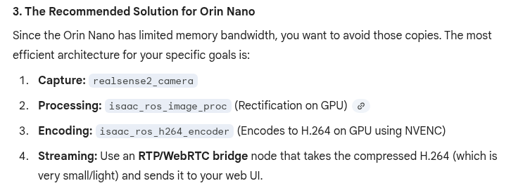

# to do's
X test simple driving
- mesh
- occupancy grid

Click the "Add Panel" button (or press Shift + A / or right-click).
Select the Map panel.
In the settings editor for the new Map panel, select the topic from the dropdown: /nvblox_node/map_slice (or whichever similar nav_msgs/OccupancyGrid topic your system is publishing).
Alternatively, if you are using the 3D Panel, you can simply turn off the Mesh topic in the left-hand sidebar, click the + Add Topic button, and add /nvblox_node/map_slice. It will overlay the clear 2D blueprint right onto the floor grid!

- go to target
- ...


# Updated
1. ./start_workspace.sh
   (finishes in docker)
2. ros2 launch rc_hardware_control rccarauto.launch.py

# In other terminals, to get into docker
cd ${ISAAC_ROS_WS}/src/isaac_ros_common/scripts
./run_dev.sh -d ${ISAAC_ROS_WS}

colcon build --packages-select rc_hardware_control --symlink-install

# useful
ros2 run teleop_twist_keyboard teleop_twist_keyboard

colcon build --packages-select pca9685_hardware_interface  --symlink-install
source install/setup.bash


# playing w/ VLM
### THIS DOESN'T FIT!!!
memory fixes

sudo systemctl restart nvargus-daemon


# to run/test
sudo ufw allow 8050/tcp
sudo ufw allow 49000/tcp

cd /mnt/nova_ssd
jetson-containers run $(autotag nano_llm)
python3 -m nano_llm.agents.web_chat --api=mlc \
  --model Efficient-Large-Model/VILA1.5-3b \
  --quantization q4f16_ft \
  --max-context-len 1024

/mnt/nova_ssd/workspaces/isaac_ros-dev/README.md


cd /mnt/nova_ssd/workspaces/isaac_ros-dev
jetson-containers run -v $PWD:/ros_workspace $(autotag nano_llm)

# to integrate
- the old vlm_brain.py was deleted (#13); rewrite it as a caller of the goal relay:
  publish a PoseStamped on /goal_pose and read the answers on /goal_relay/status
  (vocabulary and ordering in the docstring of scripts/goal_pose_relay.py)

- ros2 throttle of message to every 2 second
ros2 run topic_tools throttle messages /camera/color/image_raw 2.0 /camera/color/image_raw_slow
- python code to get image from camera, and shrink
- python code to run model
?? add in prompt from user?    send where??
chat interface
https://192.168.8.100:8050


# RC car autonomous control

once only - 
sudo nvpmodel -m 2

moved to /boot/extlinux/extlinux.conf
# for realsense camera stability
sudo sh -c 'echo -1 > /sys/module/usbcore/parameters/autosuspend'

# Force Max Performance
sudo jetson_clocks


1. Pre-Docker, ON HOST  - after every reboot
# Done at boot by rccar-host-setup.service, so start_workspace.sh needs no password.
# Install once, and again after editing configure_system.sh:
sudo scripts/install_host_setup.sh
# Without the service, by hand (asks for the sudo password):
./configure_system.sh

2. Launch Docker - then create 2 more windows or so with this - after - first is loaded
cd ${ISAAC_ROS_WS}/src/isaac_ros_common/scripts
./run_dev.sh -d ${ISAAC_ROS_WS}

Note: key files at:
- ${ISAAC_ROS_WS}/docker/.isaac_ros_dev-dockerargs (run_dev.sh reads only ~/.isaac_ros_dev-dockerargs or a copy beside itself; start_workspace.sh keeps the home file a symlink to the repo copy)
- ${ISAAC_ROS_WS}/docker/.isaac_ros_common-config (sourced on the host by run_dev.sh as ~/.isaac_ros_common-config; start_workspace.sh keeps that a symlink too)
- ${ISAAC_ROS_WS}/docker 

3. Inside Docker
./source_dev.sh
source install/setup.bash

4. Launch

# camera only (RealSense, visual SLAM, nvblox; no ros2_control, no Nav2)
ros2 launch rc_hardware_control perception_only.launch.py

# everything
ros2 launch rc_hardware_control rccarauto.launch.py

# manual move: teleop always wins over Nav2 through the velocity mux
# preferred: Foxglove Teleop panel publishing Twist on /cmd_vel_teleop (5 Hz default, 10 Hz better)
# fallback over ssh (hold the key; a single press stops after 1 s):
ros2 run teleop_twist_keyboard teleop_twist_keyboard --ros-args -r cmd_vel:=/cmd_vel_teleop

# send the car somewhere: click a point in Foxglove (it publishes /clicked_point), or
ros2 topic pub --once /goal_pose geometry_msgs/msg/PoseStamped "{header: {frame_id: odom}, pose: {position: {x: 2.0, y: 0.0}}}"
# what happened: accepted, then arrived, stuck, aborted or rejected, each with a reason.
# Goals are rejected until visual SLAM, the occupancy grid and /perception/status are ready.
ros2 topic echo /goal_relay/status

5. Test


ros2 topic echo (camera/vslam/nvblox...)
ros2 topic topic echo /visual_slam/status --once
/nvblox_node/mesh  -- camera needs to move

foxglove - 3D nvblox_node/mesh (bench only), image - /camera_preview/image/compressed

6. rebuild as needed
colcon build --packages-select rc_hardware_control  --symlink-install
source install/setup.bash


############## PCA9685 - motor test ##################
# see "Testing the hardware control" below; the full launch is the only launch


# Verify the HID modules are loaded
sudo modprobe hid-sensor-hub hid-sensor-accel-3d hid-sensor-gyro-3d

# Quick check that the camera sees the Motion Module
rs-enumerate-devices -v


# Network / ssh access (GL.iNet travel router)
# The car carries a GL.iNet router, which reaches the outside network over wifi.
# The Jetson plugs into the router's LAN by ethernet (enP8p1s0) and gets 192.168.8.100
# (gateway 192.168.8.1). The router forwards its port 2222 to 192.168.8.100:22.
#   on the router's LAN:            ssh pg@192.168.8.100
#   from the network the router is on (router's WAN address):
#                                   ssh -p 2222 pg@<router-wan-ip>
# VS Code Remote-SSH (F1 - Remote-SSH: Open configuration), ~/.ssh/config:
#   Host rc-car
#     HostName <router-wan-ip>
#     Port 2222
#     User pg
# Foxglove: foxglove_bridge listens on 0.0.0.0:8765, no auth. The full launch sets both;
# standalone, pass port:=8765 address:=0.0.0.0 (also the launch file's defaults).
# The router forwards its port 8765 to 192.168.8.100:8765. The Jetson's firewall must
# allow it once:  sudo ufw allow 8765/tcp
#   on the router's LAN:            ws://192.168.8.100:8765
#   from the router's WAN side:     ws://<router-wan-ip>:8765
#   Anyone who reaches 8765 can drive the car (/cmd_vel_teleop). On a network you don't
#   trust, drop that forward and tunnel through the ssh forward instead:
ssh -p 2222 -N -L 8765:localhost:8765 pg@<router-wan-ip>
#   then open ws://localhost:8765 in Foxglove (or forward 8765 in VS Code's Ports tab).
#   The tunnel shares the ssh connection, so heavy Foxglove traffic lags the terminal too.
#   Camera view: an Image panel on /camera_preview/image/compressed (5 Hz, 424 px wide,
#   emitter-off infra1; scripts/camera_preview.py, issue #16). The full launch's bridge
#   passes no full-rate image. Over wifi, also leave /nvblox_node/mesh (~30 Mbit/s) out.
#   Full-rate images on the bench (router LAN, not the house wifi): a second bridge that
#   listens on the Jetson only, reached through ssh (no new open port):
ros2 run foxglove_bridge foxglove_bridge --ros-args -r __node:=foxglove_bridge_bench \
  -p port:=8766 -p address:=127.0.0.1 -p send_buffer_limit:=1000000 \
  -p "topic_whitelist:=['/camera/infra1/image_rect_raw/compressed', '/depth/image_rect_raw']"
ssh -N -L 8766:localhost:8766 pg@192.168.8.100    # on the laptop; then ws://localhost:8766
# ROS traffic (DDS) never leaves the Jetson: the container's Fast DDS profile keeps UDP on
# 127.0.0.1 and turns shared memory off (config/disable_shm.xml, ROS_LOCALHOST_ONLY=0; #17).
# Keep 192.168.8.100 fixed: set an address reservation for the Jetson in the router's
# admin page (http://192.168.8.1), or the forward points at the wrong host after a new lease.
# Older addresses (before the GL.iNet router): wired 192.168.86.43, wifi 192.168.86.245
use usbc connection if this fails to find out ip address

# wifi off
sudo nmcli radio wifi off
# wifi on
sudo nmcli radio wifi on
# Check Wi-Fi status (look for "enabled" or "disabled")
nmcli radio wifi

# RealSense recovery (camera "NOT found", "Cannot identify /dev/videoN", "RGB modules inconsistency")
# In the full launch the perception watchdog recovers on its own: it holds the car while
# depth, visual SLAM odometry or the occupancy grid is stale, and restarts the perception
# bring-up after 5 s of silence or when it exits (issue #14). Watch /perception/status.
# A running camera node does not recover from a re-enumeration by itself (4.51.1 or
# 4.56.4); only a new start finds the camera. perception_only.launch.py has no watchdog.
# The container bind-mounts /dev live (docker/.isaac_ros_dev-dockerargs), so a camera that
# re-enumerated is found by the next start. No unplug, no udev reload, no container restart.
# To force a re-enumeration, from the host, no sudo needed:
usbreset 8086:0b3a
# A container started before that mount was added (before 2026-09-13) must be restarted once.
# Side effect of the live mount: the container sees the host's GPU device nodes with the
# host's permissions, and the admin user is this host user. configure_system.sh grants the
# host user the GPU scheduler/profiler nodes every start; without that the perception
# container dies with "cudaErrorNotSupported" from NitrosContext (2026-09-14).
# A dead launch still holding the old video nodes no longer matters; the new nodes get new
# numbers and the live mount shows them. Kill it anyway to free the camera cleanly:
pkill -f "ros2 launch" 2>/dev/null; pkill -f realsense 2>/dev/null; pkill -f visual_slam 2>/dev/null
# Prove the container's view is live (host and container video node lists must match),
# from the workspace root:
scripts/check_container_devices.sh isaac_ros_dev-aarch64-container
# See issue #9 for why: the camera node uses librealsense's V4L2 backend, which opens
# /dev/videoN, and without the live mount the container only had the nodes from start-up.

### first time only - top level
# Disable USB power saving
sudo sh -c 'echo -1 > /sys/module/usbcore/parameters/autosuspend'
# Force Max Performance
sudo nvpmodel -m 2
sudo jetson_clocks


## Don't do the following with realsense container - at least see if we work without
sudo chmod -R 666 /dev/bus/usb
sudo cp 99-realsense-libusb.rules /etc/udev/rules.d/
sudo udevadm control --reload-rules && sudo udevadm trigger
# this was no power saving - hopefully not needed w/ container
sudo bash -c 'echo -1 > /sys/module/usbcore/parameters/autosuspend'


##### docker starting commands
cd ${ISAAC_ROS_WS}/src/isaac_ros_common/scripts
./run_dev.sh -d ${ISAAC_ROS_WS}

#####  
#after docker launch
#####
source /opt/ros/humble/setup.bash
source install/setup.bash
# needed!! 
export LD_LIBRARY_PATH=$LD_LIBRARY_PATH:/opt/ros/humble/share/isaac_ros_gxf/gxf/lib/serialization
sudo chmod 666 /dev/bus/usb/002/003
sudo chgrp plugdev /dev/bus/usb/002/003
sudo cp 99-realsense-libusb.rules /etc/udev/rules.d/
sudo rm /etc/udev/rules.d/99-realsense-libusb-custom.rules

# nope, not in docker
sudo udevadm control --reload-rules
sudo udevadm trigger

usbreset
# Build Visual SLAM package 
colcon build --packages-select rc_hardware_control  --symlink-install
source install/setup.bash

ros2 launch rc_hardware_control perception_only.launch.py
## time sync check
ros2 run tf2_ros tf2_monitor base_link camera_infra1_optical_frame


##########

ros2 launch foxglove_bridge foxglove_bridge_launch.xml port:=8765 address:=0.0.0.0

To see your 3D data, configure your 3D Panel as follows:

Coordinate Frame: Set your "Global Frame" to map.

Transforms: Ensure /tf is active. You should see a tree connecting map -> odom -> base_link -> camera_link.

Visual SLAM Topics:

/visual_slam/tracking/odometry (Odometry type)

/visual_slam/vis/landmarks_cloud (PointCloud2)

nvblox Mesh:

/nvblox_node/mesh — Important: You must install the nvblox Foxglove extension from the Foxglove Extension Marketplace to see the textured mesh properly.

Pro-Tips for your Setup:
The Mesh: If the nvblox mesh doesn't appear, ensure you have the nvblox extension enabled in Foxglove (Settings > Extensions).

The Grid: I have set the global frame to map. If the grid looks like it's drifting, it means Visual SLAM has lost its "Loop Closure" or is re-initializing.

Performance: If the 3D view is laggy, go to the 3D panel settings and toggle "Decay Time" for the /visual_slam/vis/landmarks_cloud to a lower value (e.g., 5 seconds).

##########
# optimized, less laggy: drop messages past 1 MB queued instead of lagging behind
ros2 run foxglove_bridge foxglove_bridge --ros-args -p port:=8765 -p address:=0.0.0.0 \
  -p send_buffer_limit:=1000000 \
  -p num_threads:=2
#########################


##### continue w/ documenation
Features:
- ROS2 true, as much as possible.   Note this is using Humble.   While the most recent update from nVidia is moving to Jazzy.    This change alone will break things.
- leverage nVidia stack as much as possible (via the NVidia docker setup for Jetson (Orin) Nano/x86)
- WebRTC




[isaac ROS base page](https://nvidia-isaac-ros.github.io/v/release-3.2/index.html)


Summary Table: Component MappingGoalIsaac ROS PackageHardware Resource UsedVIO / Odometryisaac_ros_visual_slamGPU & IMUStereo Depthisaac_ros_ess (Optional)DLA / GPUMappingisaac_ros_nvbloxGPU (CUDA)PlanningNav2 (Integrated)CPU / GPUWebRTC Videoisaac_ros_h264_encoderNVENC (Video Encoder)Remote Control10isaac_ros_mission_client11CPU12

Commands of high interest:

```
docker
docker images
docker rm <number>


Launch - note the-d flag

-p 8765:8765
--shm-size=2g


## NO, we're back to using the realsense docker container - so no need for custom librealsense2


Best practice: Build librealsense2 separately with its special arguments, then build the rest of your workspace normally.


# for a colcon build - do librealsense special... 
# colcon build --packages-ignore librealsense2 --symlink-install --parallel-workers 4
colcon build --packages-ignore librealsense2 --parallel-workers 4

# per Gemini - (RSUSB/Source method is the community-standard fix for Isaac ROS users.)
# Clean and rebuild librealsense2 with correct version (2.55.1) and tools enabled
# Note: Isaac ROS requires 2.55.1. Do not use 2.57.x as it causes USB disconnects.
git fetch --all
git checkout v2.55.1

#  --parallel-workers 4
# don't need graphical examples anymore, probably
rm -rf build/librealsense2 install/librealsense2
colcon build --packages-select librealsense2 \
  --cmake-args \
    -DFORCE_RSUSB_BACKEND=ON \
    -DBUILD_WITH_CUDA=ON \
    -DCMAKE_BUILD_TYPE=release \
    -DBUILD_EXAMPLES=true \
    -DBUILD_GRAPHICAL_EXAMPLES=true
source install/setup.bash


#########################
# Testing - basic realsense
colcon build --packages-select rc_hardware_control
source install/setup.bash
ros2 launch rc_hardware_control perception_only.launch.py

ros2 launch foxglove_bridge foxglove_bridge_launch.xml port:=8765 address:=0.0.0.0

##########
# optimized, less laggy: drop messages past 1 MB queued instead of lagging behind
ros2 run foxglove_bridge foxglove_bridge --ros-args -p port:=8765 -p address:=0.0.0.0 \
  -p send_buffer_limit:=1000000 \
  -p num_threads:=2
#########################


# camera, visual SLAM and nvblox alone; add foxglove_bridge as above
ros2 launch rc_hardware_control perception_only.launch.py


## ????
sudo ufw allow 8765/tcp
sudo ufw enable
run sudo ufw allow ssh


# only needed once
sudo rm /etc/udev/rules.d/99-realsense-libusb-custom.rules
#####


Testing the hardware control
colcon build --packages-select pca9685_hardware_interface rc_hardware_control --symlink-install
source install/setup.bash

ros2 launch rc_hardware_control rccarauto.launch.py

# the Steering controller listens to the velocity mux; publish on the teleop source
# suggested max, conservative values to start with (repeat faster than the 1 s deadman)
ros2 topic pub -r 10 /cmd_vel_teleop geometry_msgs/msg/Twist "{linear: {x: 0.04}, angular: {z: 0.02}}"

# or the scripted sequence: forward, turns, reverse, stop
ros2 run rc_hardware_control test_bicycle.py

and third window
ros2 topic echo /joint_states
ros2 topic echo /joint_states --field velocity

# unit tests for the servo and traction mapping, no hardware needed
colcon test --packages-select pca9685_hardware_interface

# clean up one 'error'
sudo chmod +666 /etc


# moved back to apt install - until proven otherwise...
# Clean and rebuild librealsense2 with correct version (2.57.5) and tools enabled
# Clean and rebuild librealsense2 with correct version (2.55.1) and tools enabled
rm -rf build/librealsense2 install/librealsense2
colcon build --packages-select librealsense2 --parallel-workers 4 \
  --cmake-args \
    -DFORCE_RSUSB_BACKEND=ON \
    -DBUILD_WITH_CUDA=ON \
    -DCMAKE_BUILD_TYPE=release \
    -DBUILD_EXAMPLES=true \
    -DBUILD_GRAPHICAL_EXAMPLES=true

## Camera driver: the image's apt realsense2_camera 4.56.4 (issue #14)
# It matches the image's librealsense 2.56.4. Do not build realsense2_camera from
# source into this workspace: an overlay in install/ hides the apt driver, and its
# parameter and topic names differ.
# Check which one runs: the launch log prints "RealSense ROS v4.56.4".

# Build your control package
colcon build --packages-select rc_hardware_control

# camera, visual SLAM and nvblox (IMU stays off; fusion is pinned off in perception.launch.py)
ros2 launch rc_hardware_control perception_only.launch.py


# ✅ WORKING: RealSense D435i successfully initializing with all sensors:
# - Device Serial: 052622070363, FW: 5.17.0.10
# - Depth/IR: 848×480@30fps, RGB: 1280×720@30fps, IMU: Accel@250fps + Gyro@200fps

## Isaac ROS Visual SLAM Setup
# ✅ WORKING: Visual SLAM with RealSense D435i is operational!

# Build Isaac ROS NITROS first (required dependency)
colcon build --packages-select isaac_ros_nitros --parallel-workers 4
source install/setup.bash

# Build Visual SLAM package 
colcon build --packages-select isaac_ros_visual_slam --parallel-workers 4
source install/setup.bash

# Launch VSLAM with RealSense D435i
ros2 launch rc_hardware_control perception_only.launch.py

# ✅ VERIFIED: VSLAM topics are publishing:
# /visual_slam/tracking/odometry (main output for navigation)
# /visual_slam/tracking/slam_path (trajectory)
# /visual_slam/status (system status)
# + 20 visualization topics for debugging

# Test odometry output:
ros2 topic echo /visual_slam/tracking/odometry

# Move the camera around to see SLAM mapping in action
# Note: GXF scheduler warning is harmless and doesn't affect functionality

## Isaac ROS ESS (Bi3D Edge Stereo) Setup - APT Method
# Much simpler approach using pre-compiled packages

# Install ESS models via apt (in Isaac ROS container)
sudo apt-get update
sudo apt-get install -y ros-humble-isaac-ros-ess-models-install
sudo apt-get install -y ros-humble-isaac-ros-ess

# Build any missing dependencies
colcon build --packages-select isaac_ros_nitros_disparity_image_type --parallel-workers 4
source install/setup.bash

#########################
###########################
# Test ESS with RealSense D435i
# (the ESS experiment launches were deleted in #12; the stack uses the D435i's own depth)

ros2 launch foxglove_bridge foxglove_bridge_launch.xml port:=8765 address:=0.0.0.0
#########################
###########################


# Expected output topics:
# /depth_image - ESS-generated depth image
# /disparity - Raw disparity map
# /pointcloud - 3D point cloud from ESS depth

# ✅ This approach avoids TensorRT engine compilation issues
# ✅ Uses pre-built models optimized for your platform

## Fallback: Isaac ROS Stereo Depth Processing
# If ESS still has issues, use reliable stereo processing:
colcon build --packages-select isaac_ros_stereo_image_proc --parallel-workers 4
source install/setup.bash


```

## Foxglove Support

To use Foxglove Studio for visualization:

```bash
# Launch Foxglove bridge
ros2 launch foxglove_bridge foxglove_bridge_launch.xml port:=8765 address:=0.0.0.0

# Or run manually
ros2 run foxglove_bridge foxglove_bridge --ros-args -p port:=8765 -p address:=0.0.0.0

# Then open Foxglove Studio and connect to:
# ws://localhost:8765 (if running locally)
# ws://<robot_ip>:8765 (if running on remote robot)
```

Also
```
i2c access - fixed (using gemini AI - go there to see how)
sudo chmod 666 /dev/gpiochip0 /dev/gpiochip1 /dev/i2c-0 /dev/i2c-1 /dev/i2c-7

need video (only needed if startted without a video monitor live ???)
sudo rm /dev/fb0 && sudo mknod /dev/fb0 c 29 0 && sudo chmod 666 /dev/fb0


## already done!??
RealSense USB permissions fix (for IMU access)
sudo chmod -R 666 /dev/bus/usb

RealSense UDEV rules (proper setup for IMU)
# Note: In Docker containers, udevadm may show "Running in chroot, ignoring request" - this is normal
wget https://raw.githubusercontent.com/IntelRealSense/librealsense/master/config/99-realsense-libusb.rules
sudo cp 99-realsense-libusb.rules /etc/udev/rules.d/
sudo udevadm control --reload-rules && sudo udevadm trigger

RealSense firmware update (to enable IMU)
rs-fw-update -l  # list devices
rs-fw-update -u  # update firmware
# If firmware update fails/disconnects (Product ID 0x0adb = recovery mode):
# 1. Unplug camera for 10 seconds, reconnect
# 2. rs-fw-update -r  # recover from bootloader
# 3. rs-fw-update -u  # try update again
# 4. lsusb | grep Intel  # should show 0x0b3a when recovered

```

## Github sync
The car packages live in `src/RCCar` (pca9685_hardware_interface and rc_hardware_control) and are tracked in this repo. `src/isaac_ros_common` is vendored with vcs from `workspace.repos` and is gitignored. The camera driver is the apt `ros-humble-realsense2-camera` in the image.
```
Push

go to folder
git add .
git commit -m "next commit?"
git push

```

## vcs
The standard "Sync Up" workflow for a vcstool workspace looks like this:

- Check Status: vcs status src (See what changed).
- Commit Locally: Go into individual src/repo_name folders and git commit.
- Push Sub-Repos: vcs custom src --args push (Push the code).
- Update Map: vcs export src --exact > workspace.repos (Capture new versions).
- Push Map: git push at the top level (Push the workspace configuration).


## to install

- use vcs
- get docker going
- when inside, use rosdep

# gui on jetson orin nano

Off permanently
# Set boot to text mode
sudo systemctl set-default multi-user.target

# Reboot to apply changes
sudo reboot


Restore
sudo systemctl set-default graphical.target
sudo reboot


# t.b.d.


# NOT NEEDED NOW inside of the above
source /opt/ros/humble/setup.bash
source install/setup.bash
export LD_LIBRARY_PATH=$LD_LIBRARY_PATH:/opt/ros/humble/share/isaac_ros_gxf/gxf/lib/serialization
# Part of above, says Gemini
sudo chmod 666 /dev/bus/usb/002/003
sudo chgrp plugdev /dev/bus/usb/002/003
sudo cp 99-realsense-libusb.rules /etc/udev/rules.d/
sudo rm /etc/udev/rules.d/99-realsense-libusb-custom.rules
